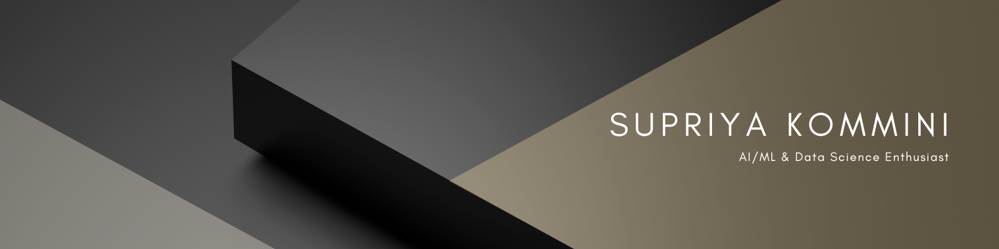

# Supriya Kommini

Amrita Vishwa Vidyapeetham  
Bangalore, Karnataka, India

Diving into the academic adventure of pursuing both Electronics and Computers Engineering and a minor degree in Artificial Intelligence and Machine Learning simultaneously at Amrita Bangalore. Imagine a fusion of electronics precision and computer creativity! Seeking opportunities to engage in internships and collaborative projects that challenge and enrich my skills. Let's connect and explore the possibilities that emerge at the crossroads of my dual academic journey!

---

### Contact

- **Email**: supriyakommini@gmail.com  
- **LinkedIn**: [linkedin.com/in/supriya-kommini](https://www.linkedin.com/in/supriya-kommini)
- **Resume**: [View PDF](https://drive.google.com/file/d/15BHWq2PvUaSbBgRbZmKPHJaDKVhevb-p/view?usp=sharing)
---

### Languages and Tools

  
  
  
  
  
  
  
  
  
  
  
  
  

